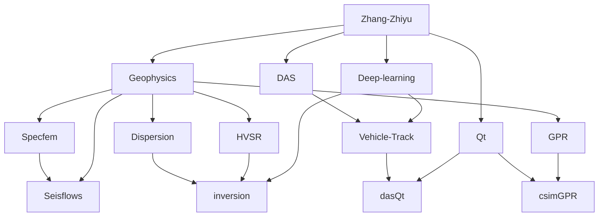

  

  

  
  
  
  

  
  
  

---

## Research & Engineering Focus

## Dynamic Contributions

<picture>
  <source media="(prefers-color-scheme: dark)" srcset="https://raw.githubusercontent.com/erbiaoger/erbiaoger/output/github-contribution-grid-snake-dark.svg">
  <source media="(prefers-color-scheme: light)" srcset="https://raw.githubusercontent.com/erbiaoger/erbiaoger/output/github-contribution-grid-snake.svg">
  
</picture>

<picture>
  <source media="(prefers-color-scheme: dark)" srcset="https://raw.githubusercontent.com/erbiaoger/erbiaoger/main/profile-3d-contrib/profile-night-rainbow.svg">
  <source media="(prefers-color-scheme: light)" srcset="https://raw.githubusercontent.com/erbiaoger/erbiaoger/main/profile-3d-contrib/profile-season-animate.svg">
  
</picture>

## GitHub Activity

  
  

  

## Star History

  <a href="https://star-history.com/#erbiaoger/hvsrUNet&Date">
    <picture>
      <source media="(prefers-color-scheme: dark)" srcset="https://api.star-history.com/svg?repos=erbiaoger/hvsrUNet&type=Date&theme=dark" />
      <source media="(prefers-color-scheme: light)" srcset="https://api.star-history.com/svg?repos=erbiaoger/hvsrUNet&type=Date" />
      
    </picture>
  </a>

---

  <b>Thanks for visiting.</b> 
  I like turning seismic signals into interpretable models, useful tools, and occasionally strange but delightful experiments.

