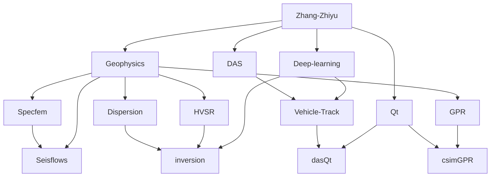

  

  

  
  
  
  

  
  
  

---

## GitHub Activity

  

## Dynamic Contributions

<picture>
  <source media="(prefers-color-scheme: dark)" srcset="https://raw.githubusercontent.com/erbiaoger/erbiaoger/main/profile-3d-contrib/profile-night-rainbow.svg">
  <source media="(prefers-color-scheme: light)" srcset="https://raw.githubusercontent.com/erbiaoger/erbiaoger/main/profile-3d-contrib/profile-season-animate.svg">
  
</picture>

<picture>
  <source media="(prefers-color-scheme: dark)" srcset="https://raw.githubusercontent.com/erbiaoger/erbiaoger/output/github-contribution-grid-snake-dark.svg">
  <source media="(prefers-color-scheme: light)" srcset="https://raw.githubusercontent.com/erbiaoger/erbiaoger/output/github-contribution-grid-snake.svg">
  
</picture>

## Research & Engineering Focus

---

## Professional Notes

My work is centered on geophysical signal processing and subsurface imaging. I am especially interested in how dense sensing systems, such as distributed acoustic sensing, can transform traffic vibration, ambient noise, and seismic wavefields into interpretable information about the near surface.

In seismic data analysis, I focus on the full path from raw records to physical interpretation: preprocessing, filtering, cross-correlation, dispersion curve extraction, HVSR analysis, inversion, and visualization. These problems are attractive because they sit between physics and computation: the wavefield contains structure, but useful structure only appears after careful signal processing and model constraints.

For inversion and machine learning, I care about methods that remain connected to geophysical meaning. Neural networks can help with denoising, segmentation, feature extraction, and fast model estimation, but the final goal is still a physically reasonable velocity structure, interface geometry, or signal interpretation rather than only a visually good prediction.

I also build scientific software because research tools should be reproducible, inspectable, and pleasant to use. A good workflow should help researchers move from field data to figures, models, and decisions with fewer manual steps and fewer hidden assumptions.

  <b>Thanks for visiting.</b> 
  I like turning seismic signals into interpretable models, useful tools, and occasionally strange but delightful experiments.

