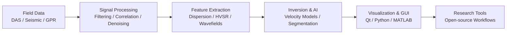

  

  

  
  
  
  

  
  
  

---

## Research & Engineering Focus

<table>
  <tr>
    <td width="50%">
      <h3>Distributed Acoustic Sensing</h3>
      
DAS data processing, spatio-temporal visualization, vehicle-induced signals, cross-correlation, automatic dispersion curve extraction, and field-data workflows.

    </td>
    <td width="50%">
      <h3>Seismology & Surface Waves</h3>
      
Seismic interferometry, surface-wave dispersion, HVSR analysis, shallow subsurface velocity models, and physics-guided interpretation.

    </td>
  </tr>
  <tr>
    <td width="50%">
      <h3>Inversion & Machine Learning</h3>
      
Deep-learning-assisted geophysical inversion, denoising, segmentation, model estimation, and reproducible scientific pipelines.

    </td>
    <td width="50%">
      <h3>Scientific Software</h3>
      
Python, MATLAB, Qt, seismic/GPR tools, visualization interfaces, and open workflows for research and engineering experiments.

    </td>
  </tr>
</table>

## Featured Projects

<table>
  <tr>
    <td width="50%">
      <h3><a href="https://github.com/erbiaoger/dasQt_apply">dasQt_apply</a></h3>
      
DAS-oriented Qt/Python workflows for signal operations, visualization experiments, and applied processing ideas.

      
<code>DAS</code> <code>Qt</code> <code>Signal Processing</code> <code>Visualization</code>

    </td>
    <td width="50%">
      <h3><a href="https://github.com/erbiaoger/hvsrUNet">hvsrUNet</a></h3>
      
Deep learning inversion of subsurface models using HVSR and dispersion information.

      
<code>HVSR</code> <code>Surface Wave</code> <code>Deep Learning</code> <code>Inversion</code>

    </td>
  </tr>
  <tr>
    <td width="50%">
      <h3><a href="https://github.com/erbiaoger/csimGPR">csimGPR</a></h3>
      
Software for interpreting lunar and Martian subsurface structures from GPR observations.

      
<code>GPR</code> <code>Planetary Geophysics</code> <code>Qt</code> <code>Interpretation</code>

    </td>
    <td width="50%">
      <h3><a href="https://github.com/erbiaoger/das-gauge-response">das-gauge-response</a></h3>
      
DAS gauge-response experiments for understanding fiber measurements and signal behavior.

      
<code>DAS</code> <code>Gauge Response</code> <code>Physics</code> <code>Signal Processing</code>

    </td>
  </tr>
  <tr>
    <td width="50%">
      <h3><a href="https://github.com/erbiaoger/Yolo_CarVelocity">Yolo_CarVelocity</a></h3>
      
Vehicle trajectory and speed extraction experiments using YOLO-based computer vision workflows.

      
<code>YOLOv8</code> <code>DAS</code> <code>Vehicle Tracking</code> <code>Computer Vision</code>

    </td>
    <td width="50%">
      <h3><a href="https://github.com/erbiaoger/voice">voice</a></h3>
      
Transform seismic signals into sound signals for exploratory listening and signal intuition.

      
<code>Seismic Signal</code> <code>Audio</code> <code>Python</code> <code>Exploration</code>

    </td>
  </tr>
  <tr>
    <td width="50%">
      <h3><a href="https://github.com/erbiaoger/seisflows">seisflows</a></h3>
      
Automated workflow tool for full waveform inversion and adjoint tomography.

      
<code>FWI</code> <code>Adjoint Tomography</code> <code>Seismology</code> <code>Workflow</code>

    </td>
    <td width="50%">
      <h3><a href="https://github.com/erbiaoger/Bagua">八卦</a></h3>
      
A side project that experiments with OpenAI-powered Liuyao divination workflows.

      
<code>OpenAI</code> <code>Fun Project</code> <code>Automation</code>

    </td>
  </tr>
</table>

## Technical Stack

  

<table>
  <tr>
    <td><b>Languages</b></td>
    <td>Python, MATLAB, C/C++, Markdown, JavaScript</td>
  </tr>
  <tr>
    <td><b>Scientific Tools</b></td>
    <td>NumPy, SciPy, PyTorch, TensorFlow, OpenCV, ObsPy-style seismic workflows</td>
  </tr>
  <tr>
    <td><b>Engineering Tools</b></td>
    <td>Qt, GitHub Actions, Linux, macOS, visualization and GUI development</td>
  </tr>
  <tr>
    <td><b>Research Domains</b></td>
    <td>DAS, seismology, surface waves, HVSR, GPR, inversion, signal processing</td>
  </tr>
</table>

## Dynamic Contributions

<picture>
  <source media="(prefers-color-scheme: dark)" srcset="https://raw.githubusercontent.com/erbiaoger/erbiaoger/output/github-contribution-grid-snake-dark.svg">
  <source media="(prefers-color-scheme: light)" srcset="https://raw.githubusercontent.com/erbiaoger/erbiaoger/output/github-contribution-grid-snake.svg">
  
</picture>

<picture>
  <source media="(prefers-color-scheme: dark)" srcset="https://raw.githubusercontent.com/erbiaoger/erbiaoger/main/profile-3d-contrib/profile-night-rainbow.svg">
  <source media="(prefers-color-scheme: light)" srcset="https://raw.githubusercontent.com/erbiaoger/erbiaoger/main/profile-3d-contrib/profile-season-animate.svg">
  
</picture>

## GitHub Activity

  
  

  

## Star History

  <a href="https://star-history.com/#erbiaoger/hvsrUNet&Date">
    <picture>
      <source media="(prefers-color-scheme: dark)" srcset="https://api.star-history.com/svg?repos=erbiaoger/hvsrUNet&type=Date&theme=dark" />
      <source media="(prefers-color-scheme: light)" srcset="https://api.star-history.com/svg?repos=erbiaoger/hvsrUNet&type=Date" />
      
    </picture>
  </a>

---

  <b>Thanks for visiting.</b> 
  I like turning seismic signals into interpretable models, useful tools, and occasionally strange but delightful experiments.

